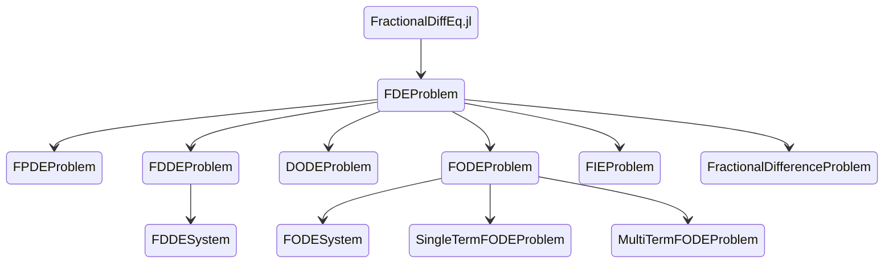

---
# try also 'default' to start simple
theme: seriph
# random image from a curated Unsplash collection by Anthony
# like them? see https://unsplash.com/collections/94734566/slidev
background: https://source.unsplash.com/collection/94734566/1920x1080
# apply any windi css classes to the current slide
class: 'text-center'
# https://sli.dev/custom/highlighters.html
highlighter: shiki
# show line numbers in code blocks
lineNumbers: false
# some information about the slides, markdown enabled
info: |
  ## Slidev Starter Template
  Presentation slides for developers.

  Learn more at [Sli.dev](https://sli.dev)
# persist drawings in exports and build
drawings:
  persist: false
---

# Fractional Order Computing and Modeling with Julia

Qingyu Qu      [@ErikQQY](https://github.com/ErikQQY)     Lead dev and maintainer of SciFracX project

<div class="abs-br m-6 flex gap-2">
  <button @click="$slidev.nav.openInEditor()" title="Open in Editor" class="text-xl icon-btn opacity-50 !border-none !hover:text-white">
    <carbon:edit />
  </button>
  <a href="https://github.com/SciFracX" target="_blank" alt="GitHub"
    class="text-xl icon-btn opacity-50 !border-none !hover:text-white">
    <carbon-logo-github />
  </a>
</div>

<!--
The last comment block of each slide will be treated as slide notes. It will be visible and editable in Presenter Mode along with the slide. [Read more in the docs](https://sli.dev/guide/syntax.html#notes)
-->

---


---
layout: default
---

# A simple introduction

Fractional calculus here means arbitrary order in fact, **fractions**, **complex**, **arbitrary**

We have a function $f(x)=x^k$, the first derivative:

$$

f'(x)=\frac{d}{dx}f(x)=kx^{k-1}

$$

And the second derivative:

$$
f''(x)=\frac{d^2}{dx^2}f(x)=k(k-1)x^{k-2}
$$

Then the $n$-th derivative:

$$

f^{(n)}(x)=\frac{d^n}{dx^n}x^k=\frac{k!}{(k-n)!}x^{k-n}=\frac{\Gamma(k+1)}{\Gamma(k-n+1)}x^{k-n}

$$


So the half derivative 🎉:

$$
f^{(\frac{1}{2})}(x)=\frac{\Gamma(2)}{\Gamma(\frac{3}{2})}x^{\frac{1}{2}}=\frac{2}{\sqrt{\pi}}x^{\frac{1}{2}}
$$

---

# But why fractional?

Fractional Modeling and Computing will only become more and more appealing[^1]


[^1]: Credit of this PPT goes to Prof Igor

---
layout: intro
---

# FractionalCalculus.jl

<style>
h1 {
  background-color: #2B90B6;
  background-image: linear-gradient(45deg, #4EC5D4 10%, #146b8c 20%);
  background-size: 100%;
  -webkit-background-clip: text;
  -moz-background-clip: text;
  -webkit-text-fill-color: transparent;
  -moz-text-fill-color: transparent;
}
</style>

---
layout: default
---

# Different sense in FractionalCalculus.jl

FractionalCalculus.jl has supports for many sense of fractional derivative and fractional integral:

<div grid="~ cols-2 gap-2" m="-t-2">

<div v-click>

## Fractional derivative

* Caputo fractional derivative

* Grunwald-Letnikov fractional derivative

* Riemann-Liouville fractional derivative

* Riesz fractional derivative

* Hadamard fractional derivative

</div>

<div v-click>

## Fractional integral

* Riemann-Liouville fractional integral

* Hadamard fractional integral


</div>

</div>


<style>
.more {
  transition: opacity 100ms ease;
}
</style>

---
layout: two-cols
---

# Detailed usage in FractionalCalculus.jl

Using FractionalCalculus.jl is just like **out-of-the-box**.

```julia
julia> fracdiff(f, order, point, step_size, alg())
```

$$
D^{0.5}\tan(x)
$$

```julia
julia> fracdiff(tan, 0.5, 1, 0.0000001, RLDiff_Approx())
2.3005095717769426
```


::right::

<br>
<br>

```julia
julia> fracint(f, order, point, step_size, alg())
```

$$
I^{0.5}e^x
$$

```julia
julia> fracint(exp, 0.5, 1, 0.0001, RLInt_Approx())
2.290697618959483
```


---
layout: two-cols
---

$$
D^\alpha x
$$


::right::

$$
I^\alpha \sin(x)
$$


---


## Symbolic Fractional Differentiation and integration

With the help of [SymbolicUtils.jl](https://github.com/JuliaSymbolics/SymbolicUtils.jl), we implemented symbolic half-order fractional differentiation and integration.

```julia
julia> using FractionalCalculus, SymbolicUtils
julia> @syms x
(x,)
julia> semidiff(log(x))
log(4x) / sqrt(πx)
julia> semiint(x^4)
0.45851597901024005(x^4.5)
```

---
layout: intro
---

# FractionalDiffEq.jl

<style>
h1 {
  background-color: #2B90B6;
  background-image: linear-gradient(45deg, #4EC5D4 10%, #146b8c 20%);
  background-size: 100%;
  -webkit-background-clip: text;
  -moz-background-clip: text;
  -webkit-text-fill-color: transparent;
  -moz-text-fill-color: transparent;
}
</style>

---

# Problems overview

<div class="grid grid-cols-3 gap-10 pt-4 -mb-6">



</div>

---
layout: center
---

# Fractional Ordinary Differential Equations

<style>
h1 {
  background-color: #2B90B6;
  background-image: linear-gradient(45deg, #4EC5D4 10%, #146b8c 20%);
  background-size: 100%;
  -webkit-background-clip: text;
  -moz-background-clip: text;
  -webkit-text-fill-color: transparent;
  -moz-text-fill-color: transparent;
}
</style>

---
layout: two-cols
---

## Single Term FODE

$$
D^\alpha y(t) = f(t, y)
$$

We can use the <kbd>SingleTermFODEProblem</kbd>

To solve the **Fractional-Relaxation** equation, we can use the **PECE** algorithm to 

### Example

$$
D^{1.8}y(x)=1-y(x)
$$

$$
y(0)=0
$$

```julia
prob = SingleTermFODEProblem(f, order, u0, T)
```

::right::

Code:

```julia
using FractionalDiffEq, Plots
fun(t, u)=1-u; tspan = collect(0:0.01:20)
prob = FODEProblem(fun, 1.8, 0, 20)
sol = solve(prob, 0.01, PECE())
plot(tspan, sol)
```


---
layout: two-cols
---

## Multi Terms FODE

General form:

$$
\sum_{i=0}^p c_iD^{\beta_i}y = f
$$

To solve a linear multiple term ordinary differential equations, we can abstract our model as <kbd>MultiTermFODEProblem</kbd>

```julia
prob=MultiTermFODEProblem(parameters, orders, rightfun, T)
```

### Example

$$
y'''(t)+\frac{1}{16} {^C_0D^{2.5}_ty(t)}+\frac{4}{5}y''(t)+\frac{3}{2}y'(t)+\\\quad\frac{1}{25}{^C_0D^{0.5}_ty(t)}+\frac{6}{5}y(t)=\frac{172}{125}\cos(\frac{4t}{5})
$$

::right::

```julia
using FractionalDiffEq, Plots
T=30;h=0.05
tspan = collect(0.05:h:T)
rightfun(x) = 172/125*cos(4/5*x)
prob = MultiTermsFODEProblem([1, 1/16, 4/5, 3/2, 1/25, 6/5], 
          [3, 2.5, 2, 1, 0.5, 1], rightfun, T)
result = solve(prob, h, FODEMatrixDiscrete())
plot(tspan, result)
```


---
layout: center
---

# System of Fractional Differential Equatoins

<style>
h1 {
  background-color: #2B90B6;
  background-image: linear-gradient(45deg, #4EC5D4 10%, #146b8c 20%);
  background-size: 100%;
  -webkit-background-clip: text;
  -moz-background-clip: text;
  -webkit-text-fill-color: transparent;
  -moz-text-fill-color: transparent;
}
</style>

---
layout: two-cols
preload: false
---

Define problem with <kbd>FODESystem</kbd> and choose a method

$$
\begin{cases}
D^{\alpha_1}x=10.725\{y-1.7802x-[0.1927(|x+1|\\\quad\quad\quad-|x-1|)]\}\\
D^{\alpha_2}y=x-y+z\\
D^{\alpha_3}z=-10.593y-0.268z
\end{cases}
$$

```julia
using FractionalDiffEq, Plots
function chua(t, x, k)
    a=10.725, b=10.593, c=0.268, m0=-1.1726, m1=-0.7872
    if k==1
        return a*(x[2]-x[1]-m1*x[1]+0.5*(m0-m1)*(abs(x[1]+1)-abs(x[1]-1)))
    elseif k==2
        return x[1]-x[2]+x[3]
    elseif k==3
        return -b*x[2]-c*x[3]
    end
end
α = [0.93, 0.99, 0.92]; x0 = [0.2; -0.1; 0.1];
h = 0.001; tn = 200;
prob = FODESystem(chua, α, x0)
result = solve(prob, h, tn, NonLinearAlg())
plot(result[:, 1], result[:, 2], title="Chua System", legend=:bottomright)
```

::right::


&nbsp;&nbsp;&nbsp;&nbsp;&nbsp;Deploy short memory effect for better simulation:


<div v-click>1</div>


<div v-after>
<div
  class="text-5xl"
  v-motion
  :initial="{ x: -380, y: -340, opacity: 0 }"
  :enter="{ x: -50, y: -570, opacity: 1 }">
  20 min → 8 min⚡
</div>
</div>
---

<div grid="~ cols-3 gap-4">


</div>

---
layout: center
---

# Fractional Partial Differential Equations

<style>
h1 {
  background-color: #2B90B6;
  background-image: linear-gradient(45deg, #4EC5D4 10%, #146b8c 20%);
  background-size: 100%;
  -webkit-background-clip: text;
  -moz-background-clip: text;
  -webkit-text-fill-color: transparent;
  -moz-text-fill-color: transparent;
}
</style>

---
layout: two-cols
---

Algorithms in FractionalDiffEq.jl focus on diffusion and advection equations of fractional orders.
<br>
<br>

$$
^C_0D^\alpha_tu-\frac{\partial^\beta u}{\partial|x|^\beta}=f(t, u)
$$

<br>
<br>

$$
D^\alpha u(x, t)=K_\alpha\frac{\partial^2u(x,t)}{\partial t^2}-V_\alpha\frac{\partial u(x,t)}{\partial x}+f(x,t)
$$

::right::


---
layout: center
---

# Fractional Delay Differential Equations

<style>
h1 {
  background-color: #2B90B6;
  background-image: linear-gradient(45deg, #4EC5D4 10%, #146b8c 20%);
  background-size: 100%;
  -webkit-background-clip: text;
  -moz-background-clip: text;
  -webkit-text-fill-color: transparent;
  -moz-text-fill-color: transparent;
}
</style>

---
layout: two-cols
---

Differential equations with fractional derivatives and delay

$$
D^\alpha_ty(t)=f(t,\ y(t),\ y(t-\tau))
$$

$$
y(t)=\phi(t),\ t\in[\xi-\tau,\ \xi]
$$

Construct problem using <kbd>FDDEProblem</kbd>.

```julia
julia> FDDEProblem(f, ϕ, α, τ, T)
```

And choose a method.


```julia
using FractionalDiffEq, Plots
ϕ(x) = x == 0 ? (return 19.00001) : (return 19.0)
f(t, y, ϕ)=3.5*y*(1-ϕ/19)
h = 0.05; α = 0.97; τ = 0.8; T = 56
fddeprob = FDDEProblem(f, ϕ, α, τ, T)
V, y = solve(fddeprob, h, DelayPECE())
plot(y, V, xlabel="y(t)", ylabel="y(t-τ)")
```

::right::

<br>
<br>
<br>


---
layout: two-cols
---

## System of FDDE

$$
\begin{cases}
D^{\alpha_1}x=a(y(t)-x(t-\tau))\\
D^{\alpha_2}y=(c-a)x(t-\tau)-x(t)z(t)+cy(t)\\
D^{\alpha_3}z=x(t)y(t)-bz(t-\tau)
\end{cases}
$$

```julia
using FractionalDiffEq, Plots
α=[0.94, 0.94, 0.94]; ϕ=[0.2, 0, 0.5]; τ=0.009; T=1.4; h=0.001
function delaychen(x, y, z, xt, yt, zt, k)
    a=35; b=3; c=27
    if k == 1
      return a*(y-xt)
    elseif k == 2
      return (c-a)*xt-x*z+c*y
    elseif k == 3
      return x*y-b*zt
    end
end
prob = FDDESystem(delaychen, ϕ, α, τ, T)
x=solve(prob, h, DelayABMYuan())
plot(x[:, 1], x[:, 2], x[:, 3], title="Fractional Order Chen Delayed System")
```

::right::

<br>
<br>


---
layout: center
---

# Distributed Order Differential Equations

<style>
h1 {
  background-color: #2B90B6;
  background-image: linear-gradient(45deg, #4EC5D4 10%, #146b8c 20%);
  background-size: 100%;
  -webkit-background-clip: text;
  -moz-background-clip: text;
  -webkit-text-fill-color: transparent;
  -moz-text-fill-color: transparent;
}
</style>

---
layout: two-cols
---

Orders of differentiation and integration is no integer nor fractions but **weight function of distribution of $\alpha$**

$$

{_0D_t^{\omega(\alpha)}}f(t):=\int_{\gamma_1}^{\gamma_2}\omega(\alpha){_0D_t^\alpha}f(t)d\alpha

$$

Construct distributed order problem using <kbd>DODEProblem</kbd> and choose a method.

```julia
julia> DODEProblem(parameters, orders, interval, T, fun)
```

$$
{_0D^{\omega(\alpha)}}u(t)+0.1u(t)=-0.1

$$

$$

u(0)=1
$$

```julia
using FractionalDiffEq, Plots
h = 0.01; t = collect(h:h:5); fun(t)=-0.1
prob=DODEProblem([1, 0.1], [x->6*x*(1-x), 0], [0, 1], t, fun)
result = solve(prob, h, DOMatrixDiscrete())
plot(t, result)
```

::right::

<br>


---
layout: center
---

# Fractional Integral Equations

<style>
h1 {
  background-color: #2B90B6;
  background-image: linear-gradient(45deg, #4EC5D4 10%, #146b8c 20%);
  background-size: 100%;
  -webkit-background-clip: text;
  -moz-background-clip: text;
  -webkit-text-fill-color: transparent;
  -moz-text-fill-color: transparent;
}
</style>

---
layout: two-cols
---

> Fractional integral equations support are still under heavy development.

With the help of [ApproxFun.jl](https://github.com/JuliaApproximation/ApproxFun.jl), FractionalDiffEq.jl is able to solve fractional integral equations.

Second kind Abel integral equation:

$$
u(x)+I^{
  \frac{1}{2}
}u(x)=1
$$

All we need to do is construct problem using <kbd>FIEProblem</kbd> and choose method to solve problem:

```julia
using FractionalDiffEq, Plots, SpecialFunctions
analytical(x) = exp(1+x)*erfc(sqrt(1+x))
x = LinRange(-1, 1, 100)
prob = FIEProblem([1, 1], [1, 0.5], 1)
sol = solve(prob, 20, x, SpectralUltraspherical())
solanalytical = analytical.(x)
plot(x, sol, title="Second kind Abel integral equation", label="Numerical")
plot!(x, solanalytical, ls=:dash, label="Analytical")
```

::right::

<br>
<br>


---
layout: two-cols
---

# Mittag Leffler functions

All kinds of Mittag Leffler function(**1, 2, 3 parameters**)

```julia
julia> mittleff(α, z)
julia> mittleff(α, β, z)
julia> mittleff(α, β, γ, z)
```

$$
E_\alpha(z)=\sum_{k=0}^{\infty}\frac{z^k}{\Gamma(\alpha k+1)}
$$

$$
E_{\alpha,\ \beta}(z)=\sum_{k=0}^{\infty}\frac{z^k}{\Gamma(\alpha k+\beta)}
$$

$$
E_{\alpha,\ \beta}^\gamma(z)=\sum_{k=0}^{\infty}\frac{(\gamma)_k z^k}{k!\Gamma(\alpha k+\beta)}
$$

::right::


<br>


<style>
h1 {
  background-color: #2B90B6;
  background-image: linear-gradient(45deg, #4EC5D4 10%, #146b8c 20%);
  background-size: 100%;
  -webkit-background-clip: text;
  -moz-background-clip: text;
  -webkit-text-fill-color: transparent;
  -moz-text-fill-color: transparent;
}
</style>

---
layout: default
---

# Future work

* Improve design pattern
* Improve performance
* Add benchmarks
* More interesting ideas

<br>
<br>

> <div class="text-2xl">📢Call for developers📢</div>

Any contributions are greatly appreciated!!